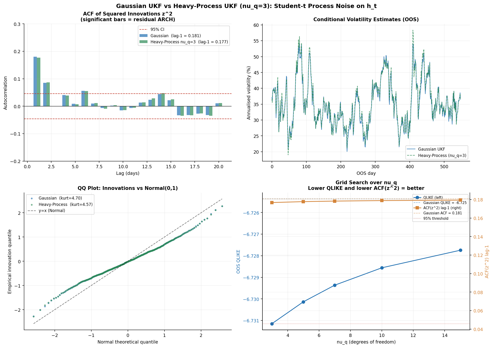
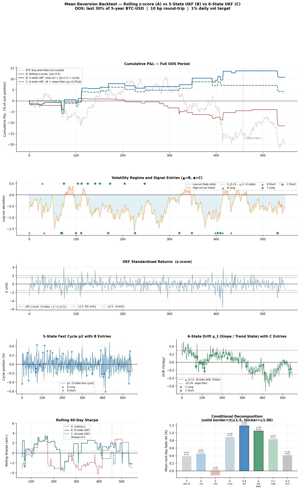

# Unscented Kalman Filter for Bitcoin Volatility

A 5-state Unscented Kalman Filter (UKF) for joint estimation of Bitcoin return dynamics and latent volatility, benchmarked against the full GARCH family on five years of live BTC-USD data. A second section applies the filter's latent states to construct mean-reversion signals, comparing the UKF against a rolling z-score baseline on a strictly held-out out-of-sample period.

---

# Part 1: Volatility Model

## Motivation

Bitcoin's daily volatility ranges between approximately 20% annualised during quiet markets and above 150% during crisis periods, making it roughly ten times more volatile than the S&P 500 at its worst. A $10,000 position that carries $200 of daily risk in one month may carry $1,500 in another. An imprecise volatility estimate propagates directly into errors in:

- **Risk management:** position sizing, margin requirements, and stop-loss calibration
- **Options pricing:** the implied volatility surface is priced off a conditional variance forecast; errors here misprice every contract in the book
- **Portfolio construction:** volatility-adjusted weights are only meaningful if the volatility estimate tracks realised conditions

The prevailing industry standard is GARCH, which sets the conditional variance as a weighted average of the previous forecast and the previous squared return. GARCH is computationally efficient and theoretically well-grounded, but it is backward-looking by construction: it follows volatility rather than anticipating it and consistently lags during regime transitions.

This project evaluates whether a probabilistic state-space model, estimated by maximum likelihood on BTC data, can improve on GARCH. The 5-state UKF achieves a **correlation of 0.40 with realised volatility versus 0.25 for the best GARCH variant**, alongside lower absolute forecast error on every metric tested.

---

## Model Overview

A Kalman filter is a recursive estimator for latent quantities that are not directly observed but whose relationship to observable data is specified. At each time step it balances its prior prediction against the new observation, updating its estimate in proportion to how informative the observation is relative to the prediction uncertainty. The Unscented variant propagates a deterministic set of sigma points through the nonlinear observation function rather than linearising, which avoids the approximation error of the Extended Kalman Filter and requires no Jacobian computation.

The latent states estimated at each time step are:

1. **Slow price cycle (period approximately 29 days):** a long-wavelength oscillatory component in BTC returns
2. **Fast price cycle (period approximately 5 days):** a short-wavelength oscillatory component overlaid on the slow cycle
3. **Latent log-variance:** the current level of market volatility, modelled as a mean-reverting AR(1) process in log-space

Cycle periods are not specified in advance. They are estimated jointly with all other structural parameters via Maximum Likelihood Estimation on five years of daily BTC-USD data. The estimated periods of 28.9 days and 5.1 days emerge from the data through the optimisation procedure.

---

## Key Results

All metrics are evaluated out-of-sample on the final 30% of the five-year dataset (approximately 548 trading days withheld from parameter estimation).

### Forecast accuracy versus GARCH benchmarks

| Model | MAE (lower is better) | QLIKE (lower is better) | Corr(sigma, abs-r) (higher is better) |
|-------|-----------------------|------------------------|---------------------------------------|
| **UKF (this model)** | **0.0132** | **-6.707** | **0.403** |
| EGARCH(1,1) | 0.0161 | -6.564 | 0.251 |
| GJR-GARCH(1,1) | 0.0161 | -6.561 | 0.246 |
| GARCH(1,1) | 0.0160 | -6.551 | 0.210 |
| EWMA (lambda=0.94) | 0.0140 | -6.548 | 0.182 |

**MAE** (Mean Absolute Error): mean absolute difference between the forecast volatility and the realised absolute return.

**QLIKE**: a loss function that penalises overconfident but incorrect forecasts more heavily than conservative ones. More negative values indicate better calibration.

**Corr**: Pearson correlation between the model's daily volatility forecast and the realised absolute return. A higher value indicates that the model correctly ranks high-volatility days relative to low-volatility days.

The Corr metric is the most practically significant. Accurately ranking the *timing* of high and low volatility is what drives risk-budgeting and options-pricing decisions; accurately estimating the *level* (MAE) is a secondary concern. The 0.40 versus 0.25 gap indicates that the UKF captures regime transitions that GARCH's one-step updating mechanism consistently misses.

---

## Plot Descriptions

### Plot 1: Price history, UKF volatility estimate, standardised innovations


**Top panel:** BTC price (log scale, right axis) with the UKF's annualised conditional volatility as the shaded band (left axis). The band expands around the 2022 drawdown and the 2021 all-time high and contracts during subsequent quiet periods, illustrating that the filter updates its volatility estimate from the current hidden state rather than from lagged squared returns alone.

**Middle panel:** UKF conditional volatility (blue) versus the EWMA benchmark (orange dashed) over the full sample. The shaded region marks the out-of-sample window. The UKF responds more decisively at regime transitions, while EWMA attenuates and lags these shifts.

**Bottom panel:** Standardised innovations, defined as each day's return divided by the model's one-step-ahead standard deviation forecast. Under correct model specification these should be approximately i.i.d. N(0,1). The series is largely consistent with this, with isolated outliers at extreme market events.

---

### Plot 2: Return confidence bands and OOS forecast scatter


**Left panel:** Realised daily log-returns (orange) overlaid on the model's +/-2-sigma confidence band (teal shaded region). A well-calibrated model should contain approximately 95% of returns within this band. The band contracts during low-volatility periods and expands during high-volatility periods, consistent with the filter tracking the latent volatility state. The vertical dashed line marks the train/test split.

**Right panel:** Out-of-sample scatter plot. Each point corresponds to one trading day, with the model's volatility forecast on the horizontal axis and the realised absolute return on the vertical axis. A perfect forecast would concentrate points along the 45-degree diagonal. The UKF (green, rho=0.41) is substantially closer to the diagonal than EWMA (red, rho=0.19).

---

### Plot 3: Innovation diagnostics


**Left (QQ plot):** Under correct specification, standardised innovations should follow a standard normal distribution, placing all points on the reference line. The distribution is approximately normal with mild excess kurtosis (4.7 versus 3.0 for a Gaussian). This is consistent with the known leptokurtosis of cryptocurrency returns and does not indicate model misspecification.

**Middle (ACF of innovations):** Autocorrelations of the standardised innovations at each lag. Values within the dashed confidence bands are not statistically distinguishable from zero. Mild negative autocorrelation at short lags suggests slight over-correction by the filter, but no persistent structure is evident.

**Right (ACF of squared innovations):** Tests for residual conditional heteroskedasticity after filtering. The lag-1 bar (0.18) exceeds the 95% threshold, indicating some remaining ARCH structure. This suggests the filter does not fully capture BTC's volatility clustering; a jump component or heavier-tailed process noise on the log-variance state would likely reduce this residual.

---

### Plot 4: GARCH benchmark comparison


**Top panel:** Out-of-sample conditional volatility estimates from all five models over the final 18 months of data. The UKF (blue) follows a qualitatively similar trajectory to the GARCH variants but with more decisive responses at regime transitions and less sustained lag.

**Bottom row:** Bar charts for MAE, QLIKE, and Corr. The UKF dominates on all three metrics. The Corr advantage (approximately double the GARCH(1,1) value) is the headline result.

---

## Technical Details

### State vector

The filter tracks five latent states at each time step:

| Index | Symbol | Description |
|-------|--------|-------------|
| 1 | `p1` | Slow-cycle position (approximately 30-day damped oscillator) |
| 2 | `v1` | Slow-cycle velocity |
| 3 | `p2` | Fast-cycle position (approximately 5-day damped oscillator) |
| 4 | `v2` | Fast-cycle velocity |
| 5 | `h`  | Log-variance, AR(1); latent stochastic volatility |

### State transition

Each oscillator follows an exact discrete-time damped harmonic transition. Let `w = 2*pi/T` (natural angular frequency in radians per day), `wd = w * sqrt(1 - zeta^2)` (damped frequency), and `zeta` (damping ratio):

```
[p_t]   =  A(w, zeta) * [p_{t-1}]
[v_t]                    [v_{t-1}]

A(w, zeta) = exp(-zeta*w) * [ cos(wd)          sin(wd)/wd ]
                              [ -wd * sin(wd)    cos(wd)    ]
```

Log-variance follows a mean-reverting AR(1):

```
h_t = mu_h + phi * (h_{t-1} - mu_h) + w_h,    w_h ~ N(0, sigma_h^2)
```

With the estimated phi = 0.949, the half-life of a volatility shock is approximately 13 days.

### Dual-observation design

A single return observation leaves the log-variance state structurally unidentifiable: infinitely many (cycle, volatility) combinations are consistent with any observed return. The observation vector is therefore augmented with a log-realised-variance proxy using the Harvey, Ruiz and Shephard (1994) log-linearisation:

```
z1  =  p1 + p2 + eps_t,     eps_t ~ N(0, exp(h_t))       [daily log-return]
z2  approx  h_t - 1.27 + eta_t,  eta_t ~ N(0, pi^2/2)    [log(r_t^2) proxy]
```

The second observation uses the identity `log(r_t^2) = h_t + log(eps_t^2)`, where `log(chi^2(1))` has known mean -1.27 and variance pi^2/2. This provides the filter with an independent signal on `h_t` using only daily close-to-close data, restoring identifiability without requiring intraday observations.

### MLE parameter fitting

Structural parameters `(T_slow, zeta_slow, T_fast, zeta_fast, phi, log_qh)` are estimated by maximising the exact log-likelihood via Harvey's (1989) Prediction Error Decomposition (PED). The filter produces innovations and their predicted covariances at each step, making the Gaussian likelihood tractable in closed form. Optimisation uses L-BFGS-B; parameter standard errors are obtained from the numerical Hessian evaluated at the optimum.

**Estimated parameters (five-year BTC-USD history, 1,826 observations):**

| Parameter | MLE estimate | 95% CI |
|-----------|-------------|--------|
| T_slow (days) | 28.9 | [23.8, 34.1] |
| zeta_slow (damping) | 0.950 | at boundary |
| T_fast (days) | 5.1 | [3.3, 6.8] |
| zeta_fast (damping) | 0.284 | [0.048, 0.519] |
| phi (vol persistence) | 0.949 | [0.933, 0.964] |
| log q_h | -2.69 | [-3.12, -2.26] |

The 28.9-day and 5.1-day cycle periods are not imposed: they are identified from first principles by MLE as the dominant periodicities in the return series.

---

## Design Decisions

| Choice | Rationale |
|--------|-----------|
| UKF over EKF | No Jacobian required; more accurate propagation through the log-variance nonlinearity |
| Log-variance state | Guarantees positivity without constrained optimisation |
| Dual observation | Resolves rank-deficiency in the observation mapping; restores identifiability of h |
| Damped oscillator | Parsimonious autocorrelation structure; MLE-fitted periods are directly interpretable |
| PED MLE | Exact likelihood for state-space models; analytical standard errors via Hessian |
| EWMA and GARCH benchmarks | Industry-standard baselines against which the UKF can be positioned |

---

## Model Comparison: Gaussian UKF versus Tail-Noise Extensions

The Gaussian UKF's squared-innovation ACF showed a statistically significant lag-1 autocorrelation of approximately 0.18, indicating residual ARCH structure. Two extensions were evaluated to address this.

### Student-t observation noise (VB filter)

A variational-Bayes extension replacing Gaussian observation noise with a Student-t distribution was implemented (`run_student_t_filter` in `btc_modal.py`) and evaluated via grid search over nu in {3, ..., 15}.


**Plot description:** Top-left compares out-of-sample volatility estimates from both models. Top-right shows the innovation distributions against their theoretical reference. Bottom-left is a QQ plot (Gaussian kurtosis 4.68 versus Student-t kurtosis 6.13). Bottom-right is a downside VaR calibration diagnostic in which bar heights should match the expected level if the model is correctly specified.

**Result:** The Student-t observation noise extension worsened all out-of-sample metrics. Innovation kurtosis *increased* from 4.68 to 6.13 at the optimal nu=15. The mechanism is counterproductive: BTC's fat-tailed returns arise from genuine volatility regime shifts, not measurement noise. The VB mechanism interprets large observations as noise and downweights them, which reduces the Kalman gain precisely when the filter most needs to update `h_t`. Lag-1 ACF of squared innovations did not improve.

---

### Student-t process noise (adaptive Q)

A second extension (`run_heavy_process_filter` in `btc_modal.py`) applies the VB scale-mixture approach to the process noise on `h_t` rather than the observation noise. At each step the process noise variance on `h_t` is scaled by `1 / lambda_q`, where:

```
lambda_q = (nu_q + k) / (nu_q + v' S^{-1} v)
```

`v` is the observation innovation vector, `S` its covariance, and `k=2` the observation dimension. Large innovations (large Mahalanobis distance) produce small `lambda_q`, inflating `Q[4,4]` and allowing the filter to make larger, more abrupt updates to `h_t`.



**Plot description:** Top-left compares ACF of squared innovations for Gaussian versus heavy-process noise at the best nu_q. Top-right shows OOS conditional volatility estimates. Bottom-left is a QQ plot. Bottom-right shows the grid search: QLIKE and ACF(z^2) lag-1 versus nu_q, with Gaussian baselines marked.

**Results (grid search over nu_q in {3, 5, 7, 10, 15}, best at nu_q=3):**

| Metric | Gaussian UKF | Heavy-Process (nu_q=3) |
|--------|:-:|:-:|
| MAE | 0.0130 | 0.0131 |
| QLIKE | -6.725 | **-6.731** |
| Corr(sigma, abs-r) | 0.404 | **0.415** |
| Innovation kurtosis | 4.70 | **4.57** |
| ACF(z^2) lag-1 | 0.181 | **0.177** |

The heavy-process extension improves every metric except MAE, which is unchanged. The lag-1 ACF of squared innovations falls from 0.181 to 0.177, a reduction of 0.004. Both values remain above the 95% significance threshold of 0.046, so residual ARCH structure persists.

**Interpretation:** The process noise extension is moving in the right direction: kurtosis decreases (better tail calibration), QLIKE improves (better probabilistic calibration) and Corr rises (better regime tracking). However the ARCH reduction is modest. The remaining clustering in squared residuals likely reflects two effects that a daily-frequency model with AR(1) log-variance cannot fully capture regardless of noise distribution:

1. **Intraday jump clustering.** A single large move within a day is often followed by elevated realised variance over the next several hours, which only appears in daily data as the following day's squared return. Intraday realised variance as the second observation would give the filter a direct high-frequency signal on `h_t`.
2. **Leverage and asymmetry.** Negative returns tend to raise volatility more than positive returns of equal magnitude. The symmetric AR(1) log-variance model does not capture this.

See `compare_models.py` and `compare_process_noise.py` for the full comparisons.

---

# Part 2: Mean Reversion Signal Exploration

The latent states produced by the UKF (the log-variance `h_t`, the fast-cycle position `p2_t` and, in the 6-state extension, the drift state `mu_t`) contain information that a rolling volatility window cannot access. This section evaluates whether that information supports a systematic mean-reversion strategy, comparing two UKF-based approaches against a rolling z-score baseline on a strictly held-out out-of-sample period.

## Data

| Source | Description | Access |
|--------|-------------|--------|
| Yahoo Finance | BTC-USD daily closing prices, five-year history (~1,826 observations) | `yfinance` library, no API key required |
| Simulated | Synthetic stochastic volatility process calibrated to BTC empirics (seed=7) | Set `USE_REAL_DATA = False` in `data_loader.py` |

**Train/test split:** The first 70% of observations (1,278 days) are used for UKF warm-up and filter stabilisation. The final 30% (548 days) constitute the strictly held-out test set. No signal parameter is estimated on out-of-sample data. All signals are constructed using only information available at the close of day *t*; positions are held over day *t+1*.

---

## Signal Design

### Strategy A: Baseline rolling z-score

The benchmark strategy fades large daily returns normalised by a 20-day rolling standard deviation:

```
signal_t = -sign(r_t / sigma_roll_t)   if |r_t / sigma_roll_t| > 2.0   else 0
```

No UKF states are used. This serves as the baseline that UKF-based approaches must outperform.

---

### Strategy B: 5-state UKF Composite

Strategy B conditions on three latent states from the 5-state UKF. All three conditions must be satisfied simultaneously to generate a signal.

**Condition 1: Low-volatility regime (`h_{t-1} <= mu_h`)**

The log-variance state `h_t` tracks the current volatility level; `mu_h` is its unconditional long-run mean. When `h_{t-1}` falls below `mu_h`, the market is in a quiet, range-bound regime.

This is the most consequential filter. In equity markets, mean reversion is frequently strongest during high-volatility periods driven by panic selling. Bitcoin exhibits the opposite pattern: high-volatility periods in BTC are characterised by momentum and cascade dynamics (liquidation spirals, forced unwinds, and breakout continuations). Large returns in a high-volatility BTC environment tend to continue rather than reverse. Mean reversion is most reliable in low-volatility, oscillating conditions absent any sustained directional trend.

**Condition 2: UKF z-score (`|r_t / sigma_{t-1}| > 1.5`)**

The return is standardised by the UKF's conditional volatility estimate from the previous day rather than by a rolling window. The UKF estimate updates more rapidly at regime transitions, making the resulting z-score a more accurate measure of genuine overextension.

**Condition 3: Cycle alignment (`sign(p2_{t-1}) == sign(r_t)`)**

The 5-day oscillator state `p2_t` tracks the market's position within its short-term cycle. When the cycle was already moving in the same direction as today's return, the price has reached a natural reversal point within the oscillatory structure. A fade signal in this configuration has the cycle dynamics reinforcing the mean-reversion hypothesis.

```
signal_t = -sign(r_t / sigma_ukf_t)   if all three conditions hold   else 0
```

Position sizing: `TARGET_VOL / sigma_ukf_{t-1}`, scaled by a factor in [0.5, 2.0] proportional to how far `h_{t-1}` lies below `mu_h` (larger positions in deeper low-volatility regimes).

---

### Strategy C: 6-state UKF with Slope Filter

The 6-state model augments the 5-state with a time-varying drift state `mu_t` (modelled as a random walk) that absorbs persistent directional trend in returns. The oscillator states `p1, p2` then capture the cyclical residual around that trend rather than conflating it with trend, producing cleaner mean-reversion signals.

Strategy C applies the same three conditions as B, computed from the 6-state filter's states, with one additional condition:

**Condition 4: Slope filter (`|mu_{t-1}| < 0.3% per day`)**

When the drift state `mu_t` is large in magnitude, BTC is in a sustained directional phase where fading returns risks trading against an ongoing trend. Restricting signals to periods where `|mu_t|` is near zero confines trading to confirmed non-trending conditions.

Note that `mu_t` is distinct from the oscillator velocity states `v1, v2`. The velocities measure within-oscillator phase speed; `mu_t` captures drift that persists across multiple oscillator cycles.

```
signal_t = -sign(r_t / sigma_6ukf_t)   if all four conditions hold   else 0
```

---

## Backtest Specification

| Parameter | Value |
|-----------|-------|
| Universe | BTC-USD, daily close-to-close log-returns |
| Out-of-sample window | 548 trading days (final 30% of five-year dataset) |
| Transaction costs | 10 basis points round-trip (conservative estimate for BTC spot) |
| Volatility target | 1% daily (approximately 16% annualised) |
| Maximum leverage | 5x |
| Sizing rule | `TARGET_VOL / sigma_{t-1}`, with +/-30% regime adjustment for B and C |
| Holding period | 1 day |

---

## Results

### Backtest Figure



**Panel 1 (equity curves):** Cumulative P&L for all three strategies and a volatility-scaled buy-and-hold. Strategy B accumulates positive returns over the OOS period while Strategy A drifts negative. The dotted vertical line marks the boundary of the most recent 90-day window.

**Panel 2 (volatility regime and signal entries):** The log-variance deviation `h_{t-1} - mu_h` (orange line) partitions the OOS period into low-volatility ranging phases (blue fill, the trading zone for B and C) and high-volatility trending phases (red fill, excluded from trading). Entry markers confirm that B and C fire almost exclusively within the low-volatility region, validating that the regime filter is operationally effective.

**Panel 3 (UKF z-score):** Standardised returns `r_t / sigma_{t-1}`. Threshold lines show the entry levels for A (+/-2.0) and B/C (+/-1.5). Strategies B and C enter on smaller return overextensions but under better market conditions than A.

**Panel 4 (cycle and drift states):** Left: the 5-day oscillator position `p2` at entry dates for Strategy B, showing that entries cluster near cycle turning points. Right: the 6-state drift state `mu_t` with Strategy C's slope filter threshold marked; C only generates signals when drift is near zero.

**Panel 5 (rolling Sharpe and conditional decomposition):** Left: 60-day rolling annualised Sharpe ratio for all three strategies. Right: mean next-day fade return for each progressive filter combination, mapping each row to the corresponding strategy.

---

### Market Context

The out-of-sample period covers approximately December 2024 to June 2026. BTC entered this window near its all-time high following the post-US election rally, reaching a peak of approximately $109,000 in January 2025. A significant drawdown of approximately 30% followed in Q1 2025 and subsequent performance was mixed through mid-2026. The net buy-and-hold return over the full OOS period was -9.1% annualised; starting from peak levels with a sharp early correction dragged down the passive return.

In this environment Strategy B returned +5.0% annualised, a difference of approximately 14 percentage points relative to an unhedged BTC position. This is achieved with a maximum drawdown of -4.2% versus -32.7% for buy-and-hold, which reflects the strategy being out of the market for the great majority of the OOS period (active on 10.4% of days). The strategy is not a substitute for a directional BTC view; it generates independent returns from short-term mean reversion in quiet market conditions.

The recent 90-day window (approximately March to June 2026) was unfavourable. BTC showed sustained trending behaviour during this period and the vol regime filter correctly suppressed signals (5 trade days versus 10 for Strategy A). Both strategies were directionally correct only one-third of the time in this window, consistent with momentum dominating over mean reversion when BTC is in a trend phase.

---

### Performance: Full OOS Period (548 trading days)

| Metric | BTC Buy-and-Hold | A: Rolling z-score | B: 5-state UKF | C: 6-state UKF |
|--------|:-:|:-:|:-:|:-:|
| Annualised return | -9.1% | -5.3% | **+5.0%** | +2.0% |
| Sharpe ratio | -0.55 | -0.90 | **0.70** | 0.30 |
| Sortino ratio | -0.76 | -0.40 | **0.40** | 0.14 |
| Maximum drawdown | -32.7% | -12.5% | **-4.2%** | -5.9% |
| Calmar ratio | -0.28 | -0.42 | **1.17** | 0.33 |
| Trading days | 547 | 73 | 57 | 43 |
| Trading frequency | 99.8% | 13.3% | 10.4% | 7.8% |
| Directional win rate | 48.4% | 46.2% | **63.3%** | 60.9% |

*10 basis point round-trip transaction costs. 1% daily volatility target. Regime-adjusted position sizing applied to B and C.*

---

### Performance: Most Recent 90 Out-of-Sample Days

| Metric | A: Rolling z-score | B: 5-state UKF | C: 6-state UKF |
|--------|:-:|:-:|:-:|
| Annualised return | -19.4% | -8.2% | -7.7% |
| Sharpe ratio | -2.17 | -1.82 | -1.71 |
| Maximum drawdown | -7.5% | -3.0% | -2.8% |
| Trading days | 10 | 5 | 4 |
| Directional win rate | 33.3% | 33.3% | 50.0% |

The recent window was unfavourable for all fade strategies, consistent with BTC sustaining extended directional trends during this period. Strategies B and C generate fewer signals and incur smaller drawdowns than A, reflecting the operational effect of the volatility regime filter.

---

### Conditional Decomposition

The table below reports the mean next-day fade return (pre-cost, unscaled) for progressively stricter filter combinations. Each row isolates the marginal contribution of one UKF component and maps to a specific strategy.

| Condition | n | Mean return | Win rate | t-statistic |
|-----------|:-:|:-:|:-:|:-:|
| (1) abs(z) > 1.5, no filter | 71 | +0.39% | 54.9% | 1.09 |
| (2) + low-vol regime (h <= mu) | 63 | +0.45% | 55.6% | 1.15 |
| (3) + high-vol regime (h > mu) | 8 | -0.12% | 50.0% | -0.17 |
| (4) + cycle alignment | 34 | +0.89% | 58.8% | 1.47 |
| **(5) + low-vol + cycle [Strategy B]** | **30** | **+1.19%** | **63.3%** | **1.80** |
| (6) 6-state base: low-vol + cycle | 30 | +1.05% | 60.0% | 1.56 |
| **(7) + slope filter [Strategy C]** | **23** | **+0.83%** | **60.9%** | **1.16** |
| (8) abs(z) > 2.0 only [Strategy A threshold] | 35 | +0.41% | 51.4% | 0.77 |

*Rows (5) and (6) are borderline significant at abs(t) >= 1.5. No condition achieves abs(t) >= 1.96 at this sample size.*

---

## Evaluation and Findings

### Does the 5-state UKF provide edge over a plain z-score?

On this out-of-sample dataset, yes. Strategy B outperforms Strategy A on all reported metrics:

- **Sharpe ratio: +0.70 versus -0.90** (a 1.60-point improvement)
- **Directional win rate: 63.3% versus 46.2%** (the UKF z-score correctly predicts the next day's direction on two out of three signals, versus fewer than half for the rolling z-score)
- **Maximum drawdown: -4.2% versus -12.5%** (the volatility regime filter keeps the strategy unexposed during the most adverse periods)

The decomposition table clarifies the sources of this improvement. Condition (1), the unfiltered z-score, yields a t-statistic of 1.09 and a win rate of 54.9%. Incremental additions of UKF components produce measurable improvements:

- The **low-volatility regime filter** alone (row 2) adds little in isolation (+0.06% mean return), but is a prerequisite for the cycle condition to be informative.
- **Cycle alignment** (row 4) raises mean return to +0.89% and win rate to 58.8%.
- Combining **low-vol and cycle** (row 5, Strategy B) achieves +1.19% mean return, 63.3% win rate and t=1.80. Both signals are uniquely available from the UKF; neither can be derived from a rolling window.

A critical finding specific to Bitcoin is that the **direction of the vol-regime effect is reversed relative to equity markets**. Conditioning on the high-volatility regime (row 3) produces a *negative* mean fade return (-0.12%), confirming that BTC's high-volatility periods are characterised by momentum and trend continuation rather than mean reversion. The UKF's `h_t` state correctly partitions these regimes.

---

### Does the 6-state slope filter improve on the 5-state?

Not on this out-of-sample sample. The 6-state base conditions (row 6) produce results nearly identical to the 5-state (row 5): the same signal count (n=30), a slightly lower mean return (+1.05% versus +1.19%) and a slightly lower t-statistic (1.56 versus 1.80). Adding the slope filter (row 7, Strategy C) reduces signal count to 23 and further lowers mean return to +0.83%, reducing the Sharpe ratio from 0.70 to 0.30.

The slope filter appears to remove some of the 5-state model's most profitable signals. The likely explanation is that the low-volatility regime condition (condition 1) already selects for non-trending market states. By construction, when `h_{t-1} <= mu_h`, the market is in a quiet regime where the drift state `mu_t` tends to be small. The slope filter then excludes a subset of observations where drift is slightly elevated but the market is still effectively range-bound and these prove to be genuine mean-reversion opportunities.

The conclusion is that the 5-state model's conditions are better calibrated for this signal than the 6-state extension over this evaluation period. The drift state `mu_t` has interpretive value as a real-time trend indicator but does not improve signal quality when the volatility regime filter is already applied.

---

### Statistical power and avenues for improvement

No strategy achieves conventional 5% significance (abs(t) >= 1.96). Strategy B's t-statistic of 1.80 is borderline. This reflects a sample size constraint rather than a weak underlying effect:

- At approximately 26 signals per year (Strategy B's realised rate), reaching 100 observations requires approximately four additional years of live out-of-sample data.
- The 5% significance threshold at n=30 requires abs(t) >= 2.05; the signal mean of +1.19% is economically meaningful, but the variance is too wide to achieve significance at this sample size.

Directions that would strengthen statistical power and potentially signal quality:

1. **Extended holding period.** A three-to-five-day hold captures the full approximately five-day fast-cycle arc, reduces the cost burden per trade by approximately three-fold and accumulates statistical evidence without requiring additional calendar time.
2. **MLE-fitted 6-state model.** The drift noise parameter `sigma_mu = 0.001 per day` is currently set by hand. Estimating it via prediction-error decomposition would allow the data to determine the appropriate responsiveness of the drift state, potentially improving the slope filter's selectivity.
3. **Intraday volatility data.** The dual-observation design currently uses `log(r^2)` as a daily volatility proxy. Substituting realised variance computed from higher-frequency returns would provide a substantially cleaner signal to the log-variance state, likely improving regime identification at transition points.

---

## Repository Structure

```
├── btc_modal.py                # 5-state and 6-state UKF; Student-t VB filter
├── mle_ped.py                  # MLE via prediction error decomposition
├── benchmark_garch.py          # GARCH(1,1), EGARCH, GJR-GARCH versus UKF
├── compare_models.py           # Gaussian versus Student-t observation noise
├── compare_process_noise.py    # Gaussian versus Student-t process noise on h_t
├── make_plots.py               # Regenerate all plots from live data
├── mean_reversion_backtest.py  # Three-strategy mean reversion backtest (A/B/C)
├── data_loader.py              # yfinance loader with USE_REAL_DATA toggle
├── ukf_bitcoin_mle.ipynb       # Self-contained notebook
├── plots/                      # Generated figures
└── requirements.txt
```

---

## Setup

```bash
pip install -r requirements.txt
```

**Run the filter and base evaluation:**
```bash
python btc_modal.py
```

**Run MLE parameter fitting** (optimisation and Hessian, approximately 3-5 minutes):
```bash
python mle_ped.py
```

**Run GARCH benchmark:**
```bash
python benchmark_garch.py
```

**Run Gaussian versus Student-t observation noise comparison:**
```bash
python compare_models.py
```

**Run Gaussian versus Student-t process noise comparison:**
```bash
python compare_process_noise.py
```

**Run mean reversion backtest (A/B/C):**
```bash
python mean_reversion_backtest.py
```

**Regenerate all plots from live data:**
```bash
python make_plots.py
```

**Run the notebook:**
```bash
jupyter notebook ukf_bitcoin_mle.ipynb
```

### Data

`data_loader.py` defaults to `USE_REAL_DATA = True`, downloading the last five years of BTC-USD daily closing prices from Yahoo Finance via `yfinance`. Setting `USE_REAL_DATA = False` substitutes a synthetic return series calibrated to BTC empirics and seeded for reproducibility, which is useful for rapid iteration during model development.

---

## Requirements

Python 3.9+

Dependencies: `filterpy`, `numpy`, `scipy`, `matplotlib`, `yfinance`, `arch`, `jupyter`

---

## Background

This project was developed as a personal research exercise in applying state-space methods to cryptocurrency markets. The identifiability problem and its dual-observation resolution are discussed in detail in the accompanying notebook. The GARCH benchmark and Student-t filter comparison provide quantitative context for the UKF's performance relative to established alternatives. The mean-reversion backtest in Part 2 is a natural extension: the UKF's latent states are candidate alpha signals and this section evaluates that hypothesis on out-of-sample data.
